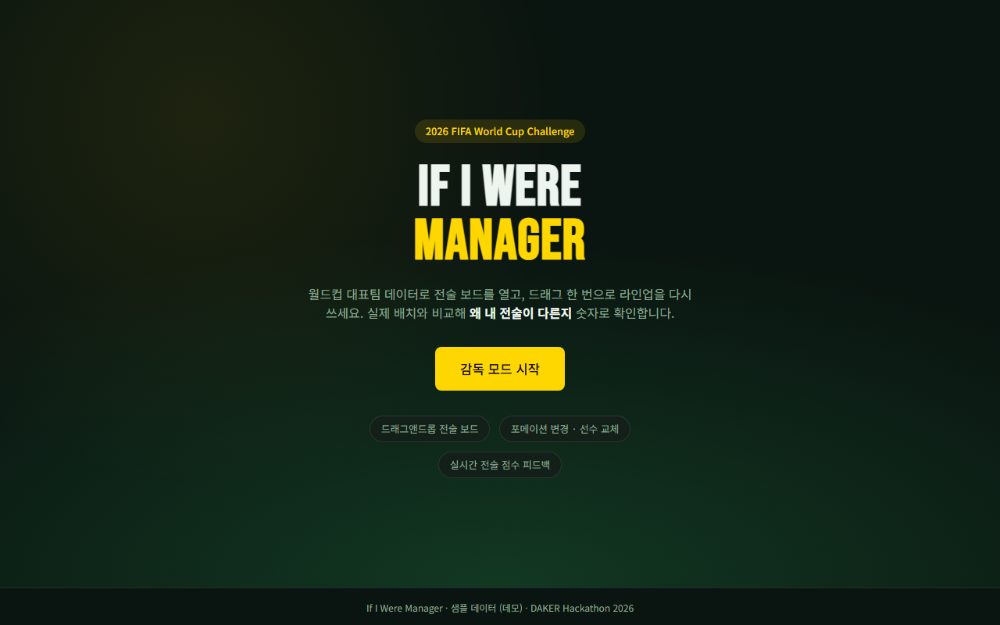
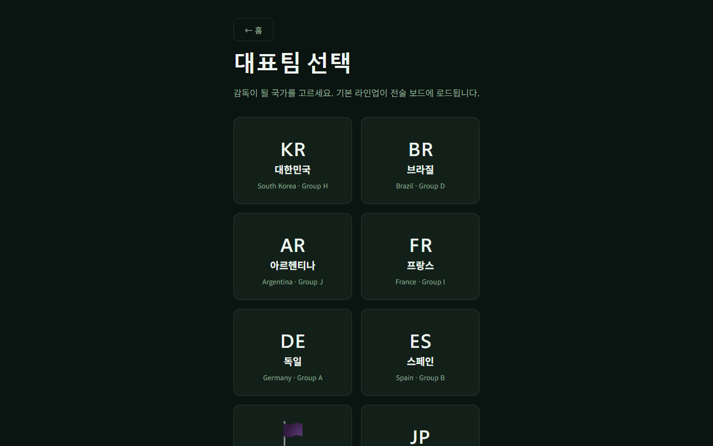
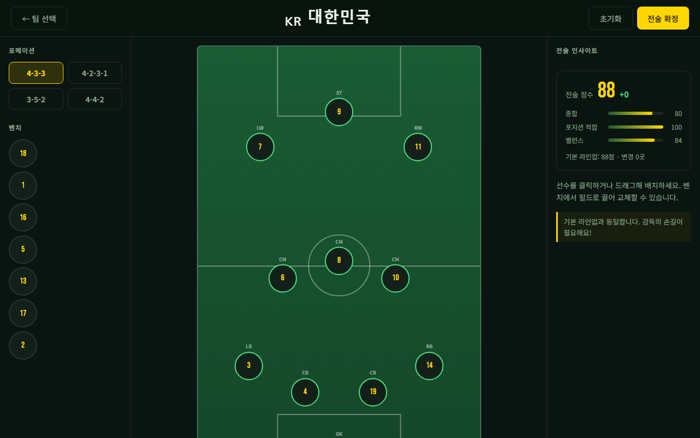
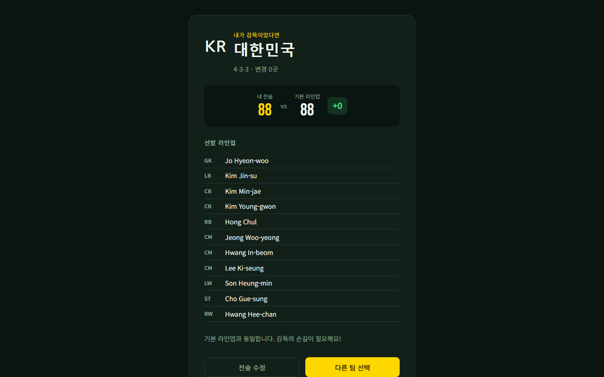

# If I Were Manager — 기획서

> DAKER 해커톤 2026 · 궉기원  
> 제출: 2026-07-22  
> 데모: https://wonderful-tapioca-0d2c73.netlify.app

> PDF: `docs/proposal/If-I-Were-Manager-proposal.pdf`  
> 재생성: `npm run proposal:pdf`

---

## 1. 뭘 만드는지

경기 보면서 "나라면 손흥민을 여기 뒀을 텐데" 같은 말 자주 하잖아요. 근데 그걸 말로만 하면 끝이고, 실제로 보드에 옮겨서 숫자로 비교해 볼 데가 없어서 만들었습니다.

**If I Were Manager**는 대표팀 라인업을 전술 보드에 띄워 놓고, 드래그로 선수를 바꾸거나 포메이션을 바꾸면 점수가 같이 움직입니다. 로그인 없이 URL만 열면 됩니다.

아래 내용은 이미 배포해 둔 데모 기준입니다. 스크린샷도 실제 화면입니다.

---

## 2. 감독 경험을 어떻게 옮겼는지

| 감독이 하는 일 | 앱에서 |
|----------------|--------|
| 포메이션 고르기 | 4-3-3, 4-2-3-1, 3-5-2, 4-4-2 중 선택 |
| 선수 올리고 내리기 | 벤치 ↔ 피치 드래그, 슬롯끼리 스왑 |
| 선수 컨디션 보기 | 카드 클릭 → PAC/SHO/PAS/DEF/PHY |
| 전술이 맞는지 감 잡기 | 오른쪽 패널에 종합·포지션·밸런스 점수 |
| 결정 내리기 | 전술 확정 → 원래 라인업이랑 비교 |

설명 글보다 손으로 움직이는 쪽이 먼저 보이게 UI를 잡았습니다.

---

## 3. 화면 구성

| 화면 | 하는 일 |
|------|---------|
| Landing | 서비스 소개, 시작 버튼 |
| Select | 8개국 중 팀 선택 |
| Board | 전술 보드 (메인) |
| Result | 내 전술 vs 기본 라인업 점수 |

흐름: Landing → 팀 선택 → 보드에서 손보기 → 전술 확정 → 결과

### 구현 화면









---

## 4. 할 수 있는 조작

- 포메이션 바꾸기 (선수 위치 자동 재배치)
- 벤치에서 피치로 드래그
- 피치 안에서 선수끼리 자리 바꾸기
- 피치에서 벤치로 내리기
- 선수 클릭해서 스탯 보기
- 배치 바꿀 때마다 전술 점수 갱신
- 전술 확정 후 결과 화면

AI 전술 추천은 시간 안 되면 빼기로 했습니다. 터치 드래그는 @dnd-kit으로 맞춰 둔 상태입니다.

---

## 5. 데이터

팀·선수·포메이션 좌표를 JSON으로 넣었습니다. API는 안 씁니다. 2026 최종 26인이 아직 안 나와서, 2022 월드컵 + 올해 예상 스쿼드를 섞은 샘플이고 화면 아래에 "샘플 데이터"라고 적어 뒀습니다.

| 항목 | 내용 |
|------|------|
| 국가 | 한국, 브라질, 아르헨티나, 프랑스, 독일, 스페인, 잉글랜드, 일본 |
| 스탯 | PAC / SHO / PAS / DEF / PHY / OVR (0~100) |
| 파일 | teams.json, players.json, formations.json |

점수 계산:

```
전술 점수 = 종합 45% + 포지션 맞음 35% + 포지션 밸런스 20%
```

종합은 선발 11명 OVR 평균, 포지션 맞음은 슬롯이랑 선수 포지션이 얼마나 맞는지, 밸런스는 수비·미드·공격 비율이 어색한지 봅니다. 완벽한 시뮬은 아니고 비교용 지표입니다.

---

## 6. 사용 흐름 (시연용)

1. 랜딩에서 시작
2. 대한민국 선택 → 4-3-3 기본 라인업 로드
3. 4-2-3-1로 바꿔 보기
4. 손흥민·황희찬 위치 바꿔 보고 점수 변화 확인
5. 전술 확정 → 원래 라인업이랑 비교

영상은 이 순서대로 2분 안쪽으로 찍을 예정입니다.

---

## 7. 기술 · 범위

| 항목 | 내용 |
|------|------|
| 스택 | Vite, React, TypeScript, @dnd-kit, Zustand |
| 배포 | Netlify (완료) |
| 이번에 안 하는 것 | 실시간 경기, 회원가입, 경기 시뮬, AI 채팅 |

| 제출물 | 마감 | 상태 |
|--------|------|------|
| 기획서 | 7/27 | 본 문서 |
| 배포 URL | 8/3 | 완료 |
| GitHub | 8/3 | 정리 예정 |
| 시연 영상 | 8/3 | 촬영 예정 |
